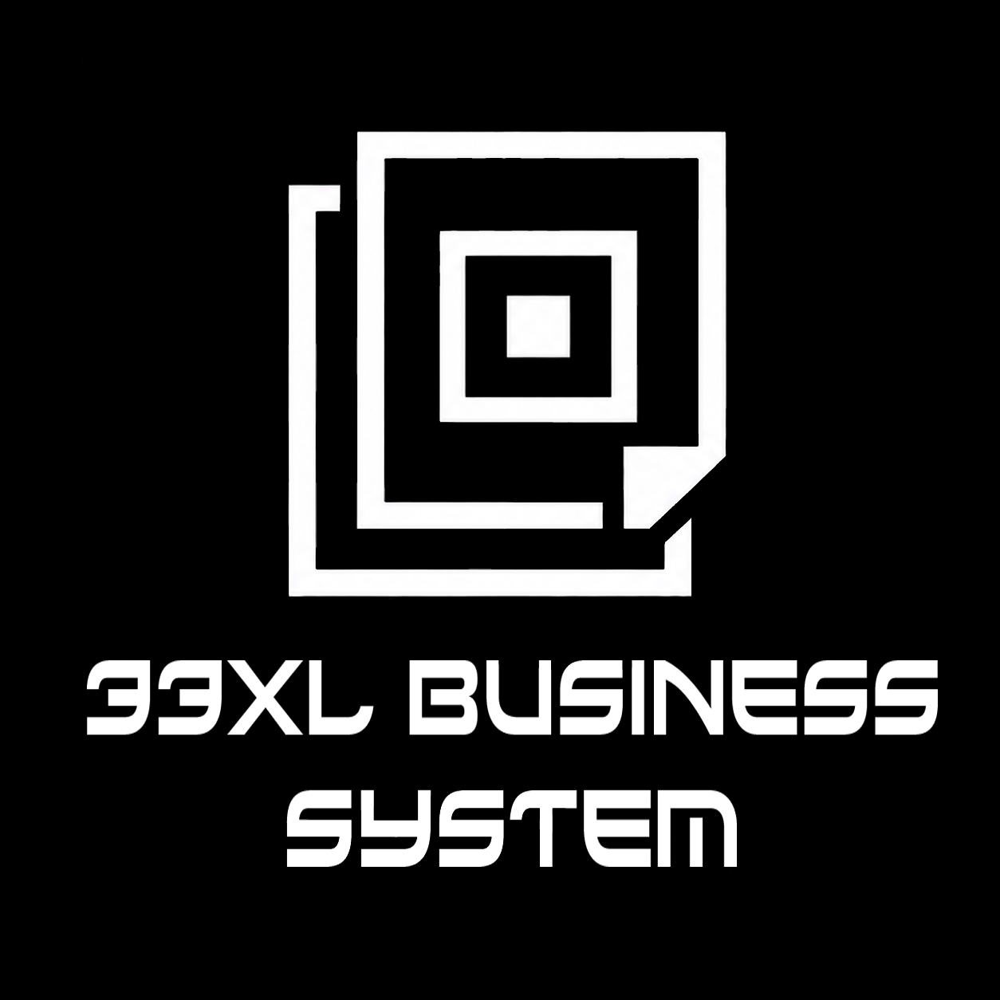

<div align="center">
  
</div>

# 33XL BUSINESS SYSTEM

**O 33XL Business System é uma plataforma modular de modelagem e organização de negócios.**
Ele atua como um "Chão de Fábrica" (Canvas) infinito onde você instancia calculadoras, tabelas e processos (Módulos), estruturando a inteligência espacial da sua operação empresarial de forma tática.

A aplicação adota a filosofia do **Brutalismo Tecnológico**: utilidade absoluta, alto contraste (Preto Absoluto e Branco), sem animações de transição lentas e sem perfumarias desnecessárias. A forma segue a matemática.

---

## 🧠 Filosofia e Motivação (A Não-Linearidade)

O desenvolvimento deste sistema nasce da necessidade de **não-linearidade na modelagem de negócios**. Softwares tradicionais de gestão impõem fluxos engessados, listas e telas pré-fabricadas. O 33XL BUSINESS SYSTEM subverte essa lógica ao fornecer um ambiente espacial totalmente modular: você não preenche relatórios, você **instancia ferramentas** numa mesa de trabalho infinita. 

Se você precisa de duas calculadoras operando simultaneamente ao lado de um fluxo de caixa e um diagrama de processos, basta arrastar os módulos para o Canvas. Essa liberdade visual permite que empreendedores e arquitetos construam suas próprias máquinas operacionais, visualizando a empresa não como um formulário estático, mas como um ecossistema vivo e mutável composto de blocos independentes.

---

## 🖤 Apoie o Projeto

Este é o primeiro projeto público a integrar a organização **[33XL-SYSTEM](https://github.com/33XL-SYSTEM)** no GitHub. Ele foi desenvolvido para ser um utilitário de escala e um bem de utilidade pública. 

No futuro, o projeto não será monetizado através de cobranças fechadas, mas sustentado pelo apoio direto da comunidade que enxerga valor neste "Chão de Fábrica" digital.

Se esta ferramenta lhe ajuda a modelar e alavancar seus negócios, considere apoiar seu desenvolvimento contínuo:
> 🔗 **[Clique aqui para apoiar o 33XL Business System através do 33XL Support System](https://33xl-support-system.vercel.app/)**

---

## ⚖️ Open Source (GPL-3.0)

O 33XL Business System é um software livre e de código aberto, protegido pela robusta licença **GPL-3.0 (GNU General Public License v3.0)**.
Isso garante a sua liberdade irrestrita para usar, estudar, modificar e distribuir o sistema, assegurando que o projeto sempre permaneça aberto e acessível à comunidade. Qualquer modificação ou obra derivada distribuída deve obrigatoriamente herdar esta mesma licença aberta.
Consulte o arquivo `LICENSE` na raiz do repositório para ler o texto integral da licença.

---

## 📚 Documentação Central

Para garantir que o projeto não perca sua linha filosófica, todo o escopo de engenharia e produto está documentado na pasta `/docs`. 

Antes de contribuir ou alterar lógicas visuais, é **obrigatório** ler os documentos abaixo:

- [Filosofia e Manifesto](docs/PHILOSOPHY.md) - A teoria dos Universos (Macro/Micro) e limites do sistema.
- [Arquitetura](docs/ARCHITECTURE.md) - Por que usamos Single Board App (Zustand + React-Rnd).
- [Design System](docs/DESIGN_SYSTEM.md) - As regras draconianas do brutalismo visual (Cores, Fontes e Formas).
- [Guia de Desenvolvimento](docs/DEVELOPMENT_GUIDE.md) - Passo a passo de como programar e injetar um novo Módulo no sistema.
- [Contrato de Dados](docs/DATA_SCHEMA.md) - Como estruturamos os JSONs que são salvos no Zustand/LocalStorage.
- [Roadmap de Módulos](docs/MODULES_ROADMAP.md) - A lista de ferramentas de negócios planejadas para existirem no Canvas.

---

## 🛠️ Stack de Tecnologia

*   **Vite + React:** Motor de renderização.
*   **Tailwind CSS v4:** Estilização utilitária de alto contraste.
*   **Zustand:** Gerenciamento de estado e persistência (LocalStorage).
*   **React-Rnd:** Motor de física (Drag and Drop / Resize) para as janelas na mesa.
*   **Lucide React:** Iconografia afiada de traço grosso.

---

## 🚀 Como Rodar Localmente

O sistema roda de forma "Local-First", sem necessidade de backend externo no estágio inicial.

```bash
# 1. Clone ou baixe este repositório
# 2. Instale as dependências
npm install

# 3. Inicie o servidor de desenvolvimento
npm run dev
```

Acesse `http://localhost:3000` (ou a porta apontada pelo Vite) em seu navegador para acessar sua mesa de trabalho infinita.

---

## 🌐 Ecossistema 33XL

Este projeto é desenvolvido e mantido pela organização **[33XL-SYSTEM](https://github.com/33XL-SYSTEM)**, fazendo parte da mesma família de ferramentas focadas em produtividade avançada, autonomia e controle de dados, ao lado de projetos como o **REPO-ACCESS-MANAGER (R.A.M)** e o **RAM-3D-MODE**.
